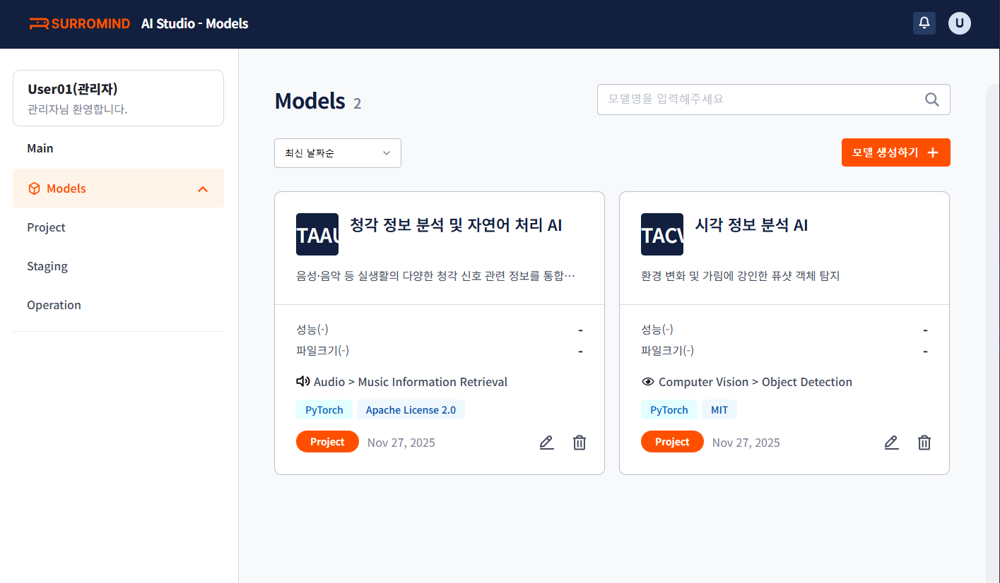

# ModelCard Platform

ModelCard Platform은 본 과제에서 개발되는 다양한 인공지능 모델들을 체계적으로 관리하기 위한 플랫폼입니다. 

## 과제 개요

### 연구개발과제명
**차세대 다중감각 통합 소셜 로봇 제어를 위한 범용 인공지능 플랫폼 개발**

### 연구기간
2025.04.01 ~ 2029.12.31 (약 5년)

### 연구목표
본 연구는 시각, 청각, 후각, 촉각 등 다양한 감각 데이터를 통합적으로 활용하여 환경을 분석하고, 이를 기반으로 인간과 유사한 사고 과정을 거쳐 상황에 적절한 행동 계획을 수립하는 범용 인공지능 플랫폼을 개발하는 것을 목표로 합니다. 또한, 해당 기술을 로봇팔 및 소셜 로봇에 임베딩하여 성능을 실증함으로써 실용 가능성을 검증하고자 합니다.

## 주요 기능
- 모델 메타데이터 관리
- 모델 버전 관리
- 모델 성능 추적 및 평가
- 모델 문서화 및 공유

## 프로젝트 구조
- `modelcard-backend/`: 백엔드 서버
- `modelcard-frontend/`: 프론트엔드 애플리케이션
- `docker/`: Docker 설정 파일
- `data/`: 데이터 저장소

